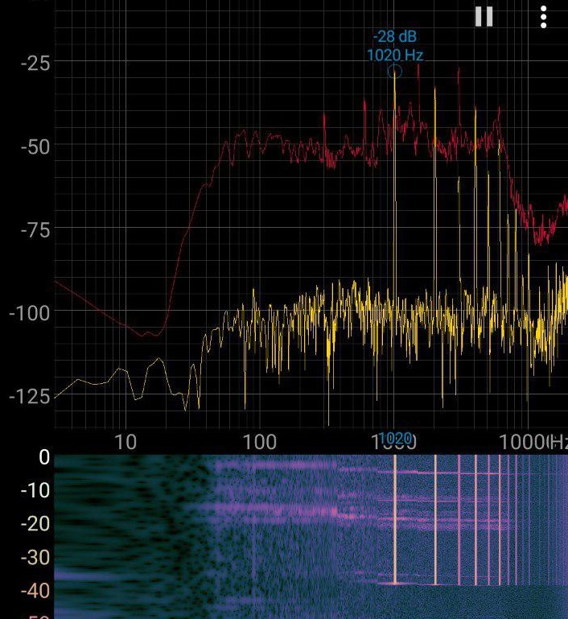

# STM32F4 Discovery board - Keil 5 IDE with CubeMX: Tutorial 28 - I2S Audio Codec - CS43L22

---

Shoutout to [@MYaqoobEmbedded](https://github.com/MYaqoobEmbedded)

Original Repository: [Stm32-Tutorials](https://github.com/MYaqoobEmbedded/STM32-Tutorials)

YouTube Video: [STM32F4 Discovery board - Keil 5 IDE with CubeMX: Tutorial 28 - I2S Audio Codec - CS43L22](https://www.youtube.com/watch?v=QIPQOnVablY)

---

This Repository contains the Code and project files to compile the example with SW4STM32 tools by ac6. Check in the tags of this git repository for the code for DAC mode and I2S mode.

- [v1.0_DAC](https://github.com/mnemocron/STM32-Tutorial-28-I2SAudioCodecCS43L22/tree/v1.0_DAC)
- [v1.0_I2S](https://github.com/mnemocron/STM32-Tutorial-28-I2SAudioCodecCS43L22/tree/v1.0_I2S)

---

### Issues

Implementation laks accuracy and acceptable THD when testing.

